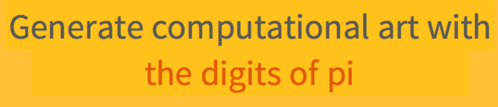
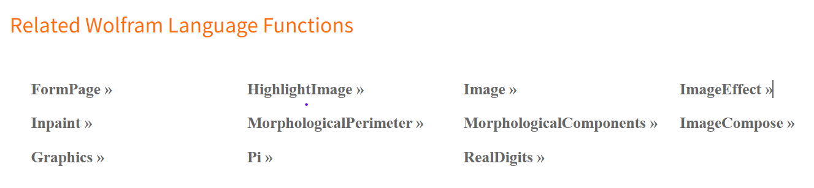

Certainly, here's a README.md file for your project:

# Project README

## Overview

This project was inspired by [Hackathon Guru](http://hackathon.guru/), a platform that provides innovative ideas and resources for hackathons. During the development of this project, I utilized the platform to get inspiration for my project idea.

## Project Resources

- **Idea Source:** [Hackathon Guru](http://hackathon.guru/)
  
  
  
  Hackathon Guru is a valuable resource for discovering creative ideas and resources for hackathons. I used this platform to find the initial idea and inspiration for this project.

- **Additional Resources:**
  
  
  
  In addition to Hackathon Guru, I also gathered various resources that have been useful throughout the project. These resources have contributed to the development and success of the project.

## Contributing

If you would like to contribute to this project, please follow the guidelines outlined in the project's [CONTRIBUTING.md](../CONTRIBUTING.md) file.

## License

This project is licensed under the MIT License - see the [LICENSE](LICENSE) file for details.

## Acknowledgments

I would like to express my gratitude to [Hackathon Guru](http://hackathon.guru/) for providing the inspiration and resources that have contributed to the success of this project.

---

Feel free to modify and expand on this README to provide more specific information about your project and how to use it.